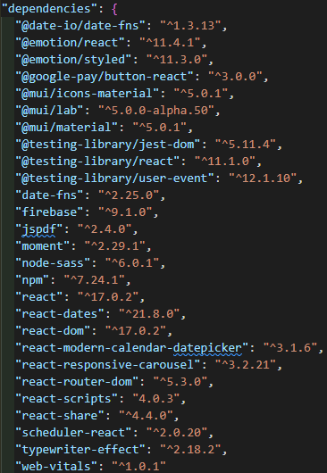

#  EMBRACE 

We identified that women in India have a lack of access to pads to sanitary pads. With the stigma and shame in buying pads, this made it more difficult for women to adopt necessary hygiene towards the natural process of menstruation. With this in mind, our team wanted to empower women to gain easy access to pads, speak up about this stigma, and tackle the problem of gender inequality in India.

We created EMBRACE to allow all women in India to use a seamless ordering system to purchase affordable pad subscription packages, as well as easily track their menstruation cycles anytime and anywhere with internet access.

# Live Website
[Embrace](https://embrace-b75f7.web.app/) is deployed live on [Firebase](https://firebase.google.com/docs/hosting).

# Guides to launch the application

### You need to enter `npm i` in the command prompt of the project root directory in order to download all the dependencies required for the website to run locally.

<br />

#### <i>Then ...</i>

<br />

### In the project directory, you can run:

### `npm run start`

Runs the app in the development mode.\
Open [http://localhost:3000](http://localhost:3000) to view it in the browser.

The page will reload if you make edits.\
You will also see any lint errors in the console.

### `npm run build`

Builds the app for production to the `build` folder.\
It correctly bundles React in production mode and optimizes the build for the best performance.

The build is minified and the filenames include the hashes.\
Your app is ready to be deployed!

See the section about [deployment](https://facebook.github.io/create-react-app/docs/deployment) for more information. But for this project, [Firebase](https://firebase.google.com/docs/hosting) was used to deploy.

# Installed Packages/Dependencies as of 20/10/2021


<br />

# Notable Technology Used

This project was bootstrapped with [Create React App](https://github.com/facebook/create-react-app). You can learn more in the [Create React App documentation](https://facebook.github.io/create-react-app/docs/getting-started).

[ReactJS](https://reactjs.org/) was mainly used for the entire project as it was bootstrapped with [Create React App](https://github.com/facebook/create-react-app).

## <b>Database</b>
### Firebase
#### `npm install firebase firebaseui`
[Firebase](https://firebase.google.com/docs/web/setup) is Google's database services and it would mainly be using the [Firestore](https://firebase.google.com/docs/firestore/quickstart) as a database. If you need to store images or documents, you can utilize Firebase's [storage](https://firebase.google.com/docs/storage).

<strong>You are required to add a config.js file - which contains all the required keys - in the util folder with the firebase configs obtained from [Firebase](https://firebase.google.com/docs/web/setup) - <i>if only you are missing it, obviously</i> </strong>
```
project
│   README.md
│   App.js
|   ...
│
└───src
   │   component
   │   context
   │   ...
   └───util
       │   firebase.js
       │   AuthRoute.js
       │   config.js <<<<<<<<<<<

```

<br />

## <b>Framework</b>
### Material UI
#### `npm install @mui/material @emotion/react @emotion/styled`  
[Material UI v5](https://mui.com/getting-started/installation/) installed. It is the main styling framework for almost all components in the project.

<br />

## Additional Notes 
### [react-router-dom](https://reactrouter.com/web/guides/quick-start) + [Node Sass](https://www.npmjs.com/package/node-sass) 
#### `npm i node-sass react-router-dom --save`

auth.js + AuthRoute.js added for security measure in blocking certain web pages from entering without logging in. Using context to persist state to ensure that the user stays logged in after refreshing the page.

Firebase [authentication](https://firebase.google.com/docs/auth) along with [Firestore](https://firebase.google.com/docs/firestore) is also used to record logging details and do simple verification checks when logging in to an account on [Embrace](https://embrace-b75f7.web.app/).

### HTML to PDF
#### `npm i jspdf --save`
[jspdf](https://www.npmjs.com/package/jspdf) is used to convert a certain part of the HTML body that is rendered and be saved in PDF format.

### [React-dates](https://github.com/airbnb/react-dates)
#### `npm i react-dates --save`
Calendar API created by [Airbnb](https://www.airbnb.com.sg/) themselves, so it is a rather versatile and flexible API to use for the website.

